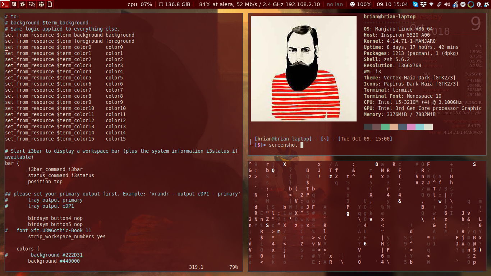
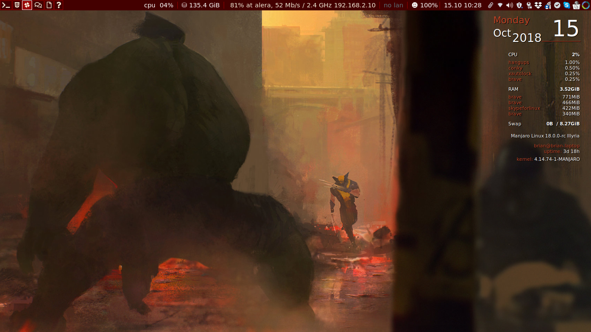
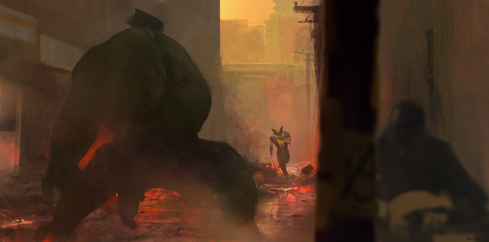

# conf_files

This is just some of the config files that I am using currently on
ArchBang with the i3 window manager. I'll add in more info here later.

## Applications

* [i3 Window Manager](http://i3wm.org)
  * [i3blocks](http://vivien.github.io/i3blocks/) - i3 status replacement
  * [cbatticon](https://github.com/valr/cbatticon) - battery tray icon
  * [volumeicon](http://softwarebakery.com/maato/volumeicon.html) - volume tray icon, don't really need this since it is handled fine by the script in i3blocks
  * [dunst](http://www.knopwob.org/dunst/) - dmenu-like notification system
  * [gsimplcal](https://github.com/dmedvinsky/gsimplecal) - tray calendar
* [rofi](https://github.com/DaveDavenport/rofi) - dmenu replacement
  * [rofi-surfraw](https://github.com/carnager/rofi-scripts/tree/master/rofi-surfraw) - frontend for surfraw using rofi
* [ranger](https://wiki.archlinux.org/index.php/Ranger) - ncurses file manager
* [hangups](https://github.com/tdryer/hangups) - 3rd party messaging app for Google Hangouts (in cli)
* [moc](https://wiki.archlinux.org/index.php/Moc) - light weight music player on cli
* [terminator](http://gnometerminator.blogspot.com/p/introduction.html) - Terminal
* [zathura](https://pwmt.org/projects/zathura/) - light weight viewer app
* [franz](http://www.meetfranz.com) - chat app wrapper, not certain I'll use this to be fair
* git_copy - stupid script to do some shit for me.

My old wallpaper is [here](.ocean_waves.jpg").
My even older Wallpaper is [here](./wtf.jpg).

### Notes
Most of these were installed in Arch via the AUR, including the git locations for some of the above if I want to implement in a separate distro.
